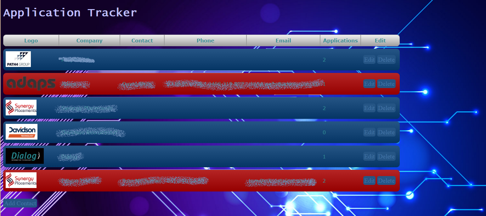
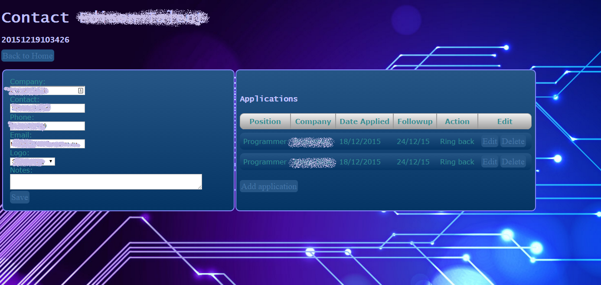

# ApplicationTracker

Welcome to my first attempt at learning Go! 
Code review/comments are welcome. I got the basic idea of structuring this app by looking at the wiki sample on the official golang website.

This app doesn't use a database or any third party products. It works on generating unique urls and this is what forms relationships between contacts and applications. Data is simply stored in text files on the server side. Next step would be to add a database of some sort. I might simply write a b-tree file algorthm to do this, after all I want to learn Go, not tie this project up into having dependancies, configuration and pre-requisites hassles. Deleting contacts/applications just simply renames references so even though you cannot view them, the informatino is still stored.

Main screen showing contacts ( ie company or agency ). Contacts highlighted in red indicate that an action needs to be performed with that contact that will occor in the next/previous 24 hours. In order for this "needs attention" feature to work. A date  needs to be entered in the followup field for the application in the format dd/mm/yy.

Editing a contact. Here you can also see applications that you have made with that contact with relevant meta-data.

